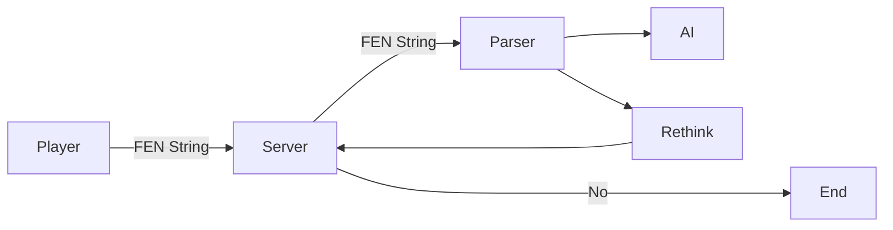

# 开发规划

### 为什么要restructure
- 旧的 code 太冗杂，不方便维护
- Develop的时候不能自动update，非常不方便

### 为什么要使用框架
使用框架是为了:
- 避免直接操作DOM
- 更方便地使用各种库(drag and drop, axios, socket.io)

### 使用 REACT.js 不用 Vue.js 的理由
- Vue.js 对于团队中的成员来说是新的框架，需要花时间学习API
- Vue.js 脱离不了对 dom 的操作
- React.js 有 rfc 和 rcc 两种 components 可用，灵活性更大

### React与直接操作dom的区别
- update 数据，React 自动重新渲染
-   

### 三种设计思路

根据组件类型以及如何与数据结合想到了三种设计思路

- rfc 
- rcc 
- rfc + ts chess classes 

#### Functional Components
优点:
- 现在的库不管是说明文档还是它们开发时都在使用rfc，少走弯路
- Hook的使用让开发变得简便
- 用Context传数据很方便

缺点:
- 不能使用OOP惯用的继承模式

#### Class components
优点: 
- OOP的开发方式
- 充分发挥typescript的优势

缺点:
- 很多用hook的库比如 react-dnd 就用不了了
- 继承在这个象棋棋子之间并不是必须的，也省不了很多功夫
- React DOM 创建的 element 并不能像真正的 JS Object 一样在React代码里获取（或者我还没找到好的方法来获取）
- 用Context的时候想要直接 update context 需要在`<Context.consumer>` 里面调用function. <https://reactjs.org/docs/context.html#updating-context-from-a-nested-component>

### RFC + 旧的 ts classes
优点:
- OOP的开发方式
- 使用 DND 库
- 使用 hooks

缺点:
- <b>可行性存疑</b> (或许需要先试验一下):
  - 如何获取一个REACT DOM 里面所含有的数据
- 旧的 .ts classes 里面各种 fucntion 都是基于html dom manipulation 来写的，不适用于在react框架里面使用

### 一些参考
<https://codesandbox.io/s/react-dnd-02-chess-board-and-lonely-knight-7buy2?from-embed>

<https://codesandbox.io/s/react-dnd-03-chess-board-and-lonely-knight-zoc1s>

## AI 与 PVP对战

### AI 所需的功能
- 通过parse Board 里面的局面数据获取 FEN Sring
- 服务器与客户端用 socket.io 来进行通讯， 传送 FEN String
- 服务器端读取 FEN String 然后传送给相关的utils
- MinMax算法提供最佳移动位置
- 传回给客户端

### 人机对战
- socket.io 传送 红方 的移动给服务器
- 服务器 update 此 Game 的局面，存在 db 里， 方便用于后期棋局研究，或者悔棋功能
- 服务器 把移动信息传送给黑方

